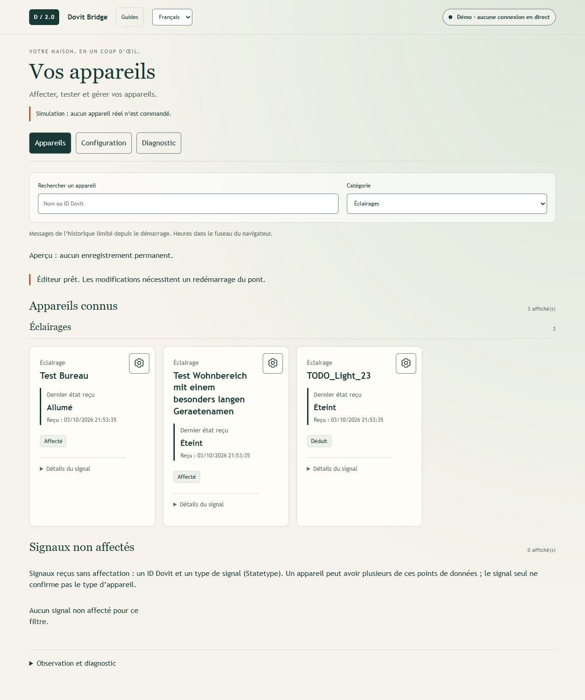
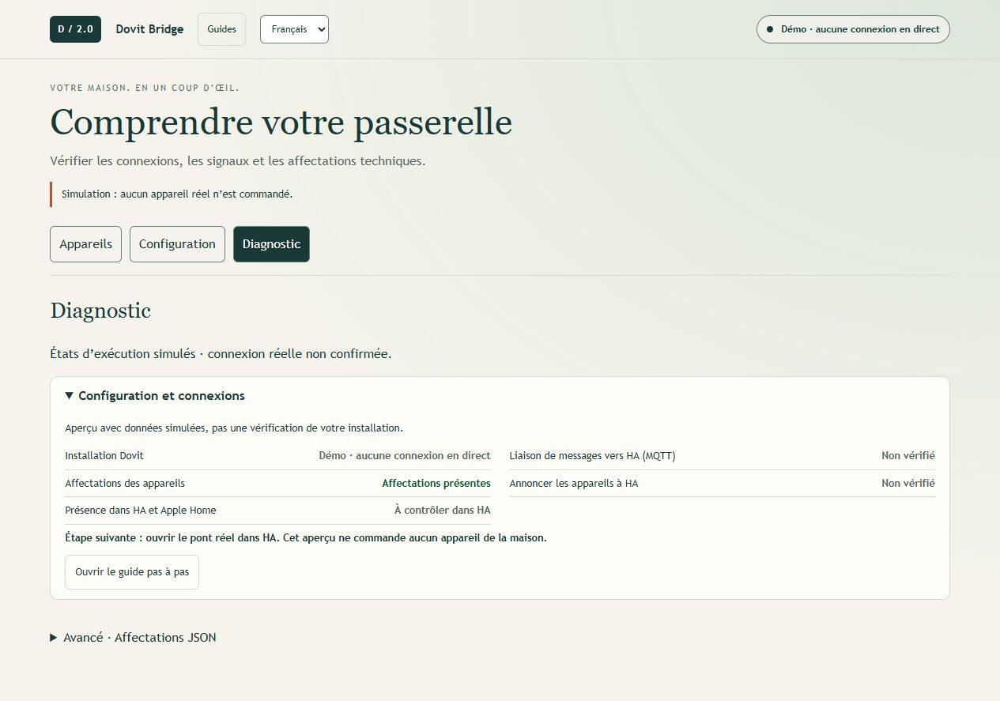
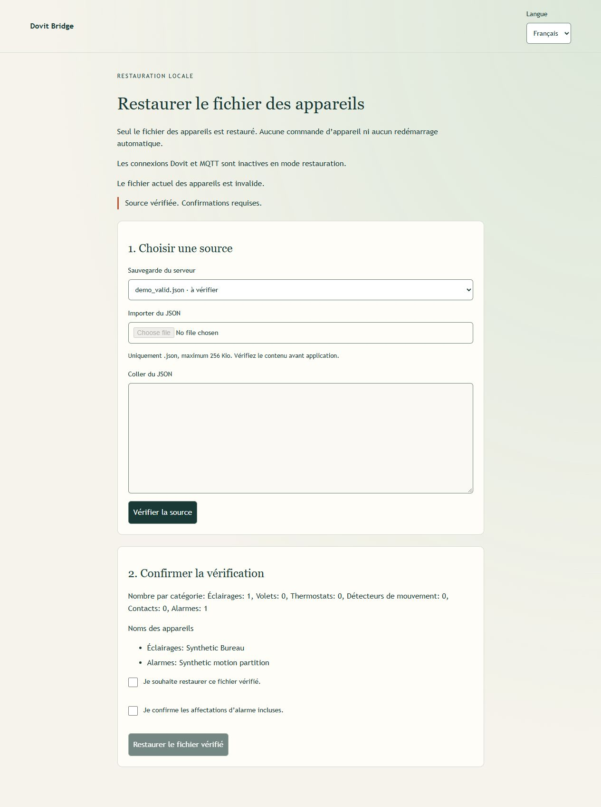
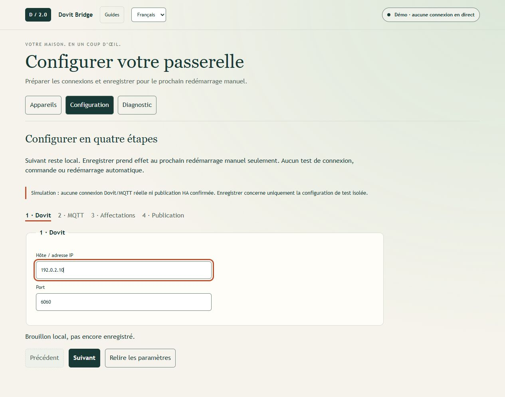
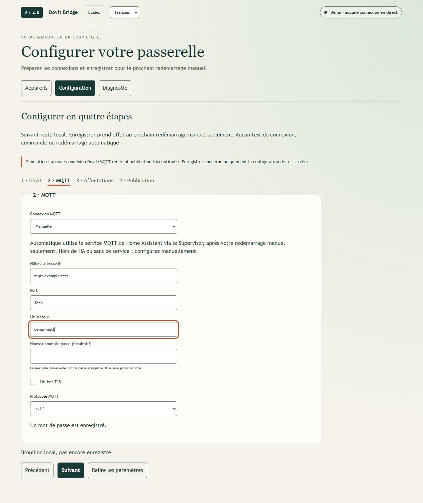
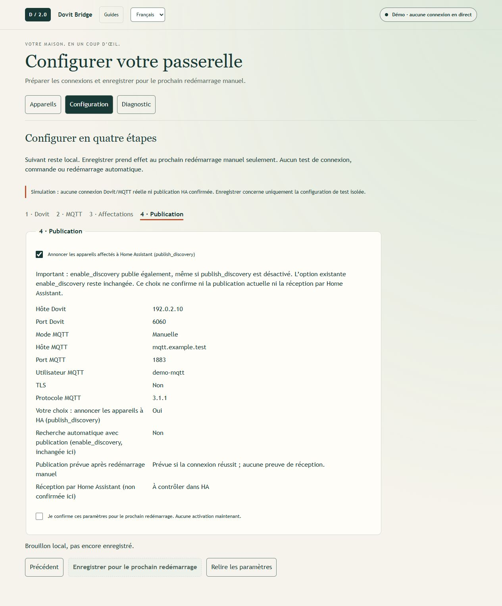
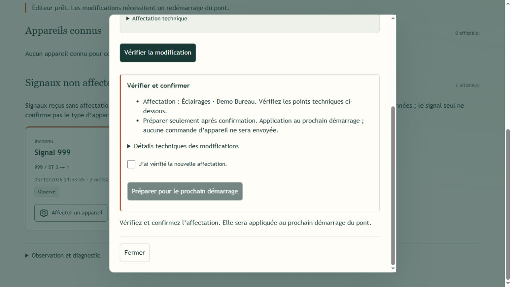
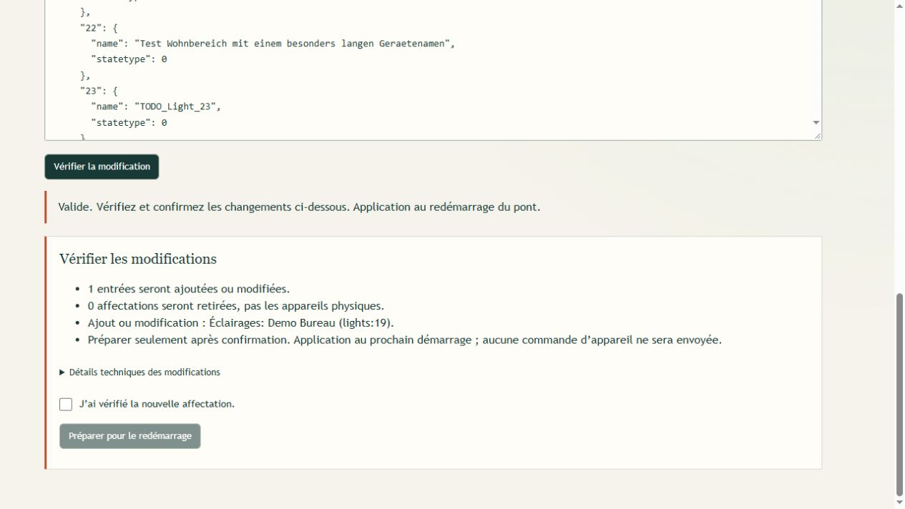

# Guide utilisateur - D2HA Bridge

**Changement de nom :** Le nom public du produit est D2HA Bridge. La version installable 2.2 apparaît encore dans HA sous **Dovit Bridge** ; 3.0.0 n’est pas publiée. Les chemins de menus ci-dessous utilisent le nom du produit. Conserver l’entrée du dépôt, l’installation, les options, les affectations et les identités MQTT/HomeKit existantes. Le renommage GitHub ne nécessite pas de réinstallation.

Utilisation non commerciale du logiciel inchangé : gratuite. Les modifications
du logiciel ou de ses documents et l’usage commercial exigent une permission
écrite préalable ; les conditions commerciales sont convenues séparément.
Vos propres réglages et affectations sont autorisés et restent vos données.
Licence : https://github.com/SPRuben/d2ha-bridge/blob/main/LICENSE

## Découvrir 2.2 : Appareils, Configuration et Diagnostic

Ce guide décrit le code 2.2 dans le paquet public expérimental. Son installation
depuis ce dépôt sur un nouveau HA et sa compatibilité avec d’autres installations
Dovit ne sont pas encore confirmées en conditions réelles. Les anciennes notes
sont conservées sous « Notes de versions historiques ».
Guide d’installation : https://github.com/SPRuben/d2ha-bridge/blob/main/dovit_bridge/DOCS.md

Les illustrations proviennent de la prévisualisation 2.0 avec des appareils
simulés et des données de test. Elles aident à se repérer et ne prouvent ni une
connexion à votre installation Dovit ni la réception des appareils dans HA/HomeKit.
Les noms, ID et paramètres visibles sont des exemples.

Les trois espaces ont des fonctions distinctes :

- **Appareils :** lire les états reçus, observer et affecter des signaux, puis modifier des appareils existants.
- **Configuration :** préparer Dovit et MQTT en quatre étapes, puis enregistrer pour le prochain redémarrage manuel.
- **Diagnostic :** contrôler les connexions en cours et modifier le fichier actif sous **Avancé · Affectations JSON**.

Si le fichier des appareils manque ou est invalide, l’assistant séparé de
récupération apparaît à la place. Après une perte de données, restaurez d’abord
votre sauvegarde ; « Préparer une nouvelle installation » convient uniquement
à une installation réellement neuve. Redémarrez ensuite vous-même le pont.

« Suivant » vérifie les saisies localement. Enregistrer ne lance ni test de
connexion, ni redémarrage, ni commande d’appareil. Un réglage enregistré ou une
connexion MQTT ne confirme pas la réception des appareils dans HA/HomeKit.
L’assistant n’active aucun test et ne modifie aucun code d’alarme.

## S’orienter et commencer

Un fichier d’appareils valide mais vide n’est pas une configuration endommagée.
Si aucun appareil de la maison n’est affecté, **Appareils** propose un accès à
**Configuration** et au guide pas à pas. Une horloge système seule n’est pas
encore un appareil domestique affecté. Si seuls une recherche ou un filtre de
catégorie masquent les résultats, vérifiez le filtre sans créer une installation.



Vue des appareils : utiliser le filtre Éclairages pour comparer les noms et états d’exemple des éclairages.

Sous **Diagnostic → Configuration et connexions**, Dovit, MQTT, les affectations
et la publication HA sont séparés. Cette vue lit l’état en cours ; elle ne teste
pas vos saisies non enregistrées ou en attente et ne change aucune option.
Des états simulés, absents ou anciens ne prouvent pas une connexion réussie.
Contrôlez toujours HA et Apple Home séparément.



Diagnostic : lire séparément les connexions, les affectations et la publication pour identifier un problème de connexion.

Dans **Appareils → Signaux non affectés**, **Affecter un appareil** ouvre
directement le formulaire. Les appareils connus gardent l’engrenage
**Gérer l’appareil**. Le texte technique se trouve dans **Diagnostic → Avancé ·
Affectations JSON**, pas dans un second espace d’appareils. **Retour aux appareils**
ramène à la vue des appareils ; un brouillon JSON non enregistré est conservé
lors du changement de vue.

## Pas à pas : de l’installation à la modification d’un appareil

Ces étapes concernent le code 2.2. Une installation plus ancienne peut proposer
d’autres fonctions ou libellés. Les adresses et identifiants sont des exemples,
pas les valeurs vérifiées de votre installation. Avant une mise à jour, sauvegarder
les données et options réellement utilisées.

### 1. Vérifier les prérequis

Le chemin est : Dovit TCP/XML > D2HA Bridge > broker MQTT >
intégration MQTT de Home Assistant > éventuellement HomeKit Bridge.

- Une installation Dovit fonctionnelle avec accès TCP/XML joignable ; par exemple le port 6060 ; vérifier le port réel de votre installation. La compatibilité de tous les accès Dovit n’est pas garantie.
- Home Assistant avec prise en charge des apps, par exemple Home Assistant OS, et un compte administrateur. HA Container ne propose pas cette installation d’app.
- Un broker MQTT actif, par exemple l’app Mosquitto, et des identifiants MQTT valides. L’assistant n’installe aucun broker.
- L’intégration MQTT de HA connectée au même broker, avec MQTT Discovery.
- Un réseau permettant au pont de joindre Dovit et le broker ; des adresses IP stables sont utiles.
- Votre propre fichier d’appareils avec des ID et types de signal vérifiés, ou un démarrage volontairement vide.
- Pour Apple Home, l’intégration HA HomeKit Bridge en plus ; elle n’est pas nécessaire au pont Dovit.

L’**ID de l’appareil** est l’identifiant Dovit ; le **Type de signal (Statetype)**
est le type technique de la valeur reçue. Ensemble, ils forment un point de
données. Un ID seul n’indique pas s’il s’agit d’une lumière, d’une température
ou d’un état d’alarme. Les clés techniques JSON telles que `statetype` restent
inchangées. Ne reprenez jamais les affectations d’une autre maison.
N’exposez pas les ports Dovit, MQTT ou de prévisualisation sur Internet.

### 2. Installer l’app et préparer MQTT

1. Pour une installation existante, sauvegarder HA et le fichier actif d’appareils. Sauvegarder les fichiers réels avant remplacement, pas seulement la copie de développement locale.
2. Dans Paramètres > Apps > Magasin d’apps > menu > Dépôts, ajouter https://github.com/SPRuben/d2ha-bridge. Les anciennes versions de HA utilisent le terme « modules complémentaires ».
3. Actualiser le magasin, choisir D2HA Bridge et installer. Architectures publiques : amd64/aarch64. Arrêter l’ancien pont local avant toute migration ; ne jamais démarrer les deux ensemble. Les paramètres privés /data ne sont pas transférés automatiquement dans l’app du dépôt.
4. Démarrer le broker et créer un utilisateur adapté à MQTT. Des exemples comme `mqtt-user` ne garantissent aucun accès.
5. Dans Paramètres > Appareils et services, configurer l’intégration MQTT ou vérifier sa connexion. Le broker et l’intégration sont deux composants différents.

Cette installation par dépôt nécessite les apps et construit l’image depuis les
sources. Aucune copie manuelle vers /addons n’est nécessaire. Sauvegarder vos
affectations /share et options avant une migration ; détails dans DOCS.md.
Documentation MQTT : https://www.home-assistant.io/integrations/mqtt

### 3. Définir les options de base avant le démarrage

Ouvrir Paramètres > Apps > D2HA Bridge > Configuration. Les options
`devices_file`, `enable_discovery`, tests web réels, mode des volets et alarme
restent ici. Elles ne vont ni dans le JSON des appareils ni dans
`configuration.yaml` de HA ; l’assistant web ne les modifie pas.

Dovit, MQTT et `publish_discovery` peuvent ensuite être préparés sous
**Configuration**. Les réglages web déjà enregistrés dans `/data/dovit_setup.json`
prennent priorité sur les options correspondantes de l’app après redémarrage.
Une autre valeur dans l’app HA seule ne les remplace donc pas. Vérifier les
options existantes au lieu de les remplacer par cet exemple manuel :

```yaml
dovit_host: "192.0.2.10"
dovit_port: 6060
mqtt_mode: "manual"
mqtt_host: "core-mosquitto"
mqtt_port: 1883
mqtt_user: "VOTRE_UTILISATEUR_MQTT"
mqtt_pass: "VOTRE_MOT_DE_PASSE_MQTT"
mqtt_tls: false
mqtt_protocol: "3.1.1"
devices_file: "/share/dovit_devices.json"
enable_discovery: false
publish_discovery: true
web_light_control: false
web_device_control: false
cover_position_mode: "legacy"
alarm_code: ""
```

| Option | Valeur ou précaution |
| --- | --- |
| dovit_host / dovit_port | Adresse et port TCP/XML de votre Dovit ; l’adresse de l’exemple n’est pas nécessairement la vôtre. |
| mqtt_mode | `manual` pour vos propres paramètres ; `supervisor` est la valeur technique de **Service MQTT de Home Assistant (automatique)**. Aucun changement automatique d’une installation existante. |
| mqtt_host / mqtt_port / mqtt_user / mqtt_pass | Paramètres du mode manuel ; identifiants MQTT, pas ceux de l’app Dovit. |
| mqtt_tls / mqtt_protocol | Choisir TLS et un protocole MQTT pris en charge en mode manuel ; TLS vérifie le certificat et le nom d’hôte. |
| devices_file | Fichier actif persistant ; `/share/dovit_devices.json` par défaut. |
| enable_discovery | Recherche heuristique de lumières/volets avec publication ; reste inchangée dans l’assistant web. Laisser désactivée pour un nouveau départ contrôlé. |
| publish_discovery | Annoncer à HA les appareils affectés et nommés ; aussi disponible dans l’assistant. `enable_discovery: true` publie également. |
| web_light_control / web_device_control | Tests réels facultatifs depuis la page ; désactivés au départ. Ils ne bloquent pas les commandes MQTT normales de HA/HomeKit. |
| cover_position_mode | `legacy` pour montée/descente/stop. `timed` seulement après calibration vérifiée de chaque volet ; aucune mesure automatique de position. |
| alarm_code | Seulement pour une fonction alarme déjà préparée, selon son guide ; ce n’est pas un mot de passe Dovit ou MQTT. |

Il n’existe pas d’option d’app pour un utilisateur ou mot de passe Dovit.
Si votre installation exige une authentification supplémentaire, vérifier sa
prise en charge d’abord. Les identifiants MQTT ne la remplacent pas.

### 4. Préparer ou restaurer le fichier des appareils

Le paquet public ne fournit aucun fichier actif d’appareils. Configurer le véritable
hôte Dovit à la place de 127.0.0.1 et les identifiants MQTT laissés vides par défaut
avant le fonctionnement normal. 192.0.2.10 est une adresse de documentation.

1. Pour une installation existante, placer votre propre JSON vérifié au chemin configuré, par exemple via Samba dans le dossier share de HA.
2. Uniquement pour une installation réellement neuve, choisir « Préparer une nouvelle installation » dans l’assistant. Ce bouton prépare un brouillon vide : vérifier, donner le consentement supplémentaire pour une source vide, puis redémarrer manuellement. Le JSON vide suivant est une autre source volontaire ; il ne répare pas les affectations perdues.
3. Enregistrer les options et démarrer le pont. Lire les logs avant toute commande.

```json
{
  "lights": {},
  "shutters": {},
  "thermostats": {},
  "motions": {},
  "contacts": {},
  "alarms": {}
}
```

Si le fichier manque ou est invalide, seul l’assistant séparé de récupération
démarre : charger un fichier, coller du texte ou choisir une sauvegarde, vérifier,
lire l’aperçu puis confirmer explicitement. Les affectations d’alarme et une
source vide demandent un consentement supplémentaire. L’assistant ne connecte
ni Dovit ni MQTT et ne commande aucun appareil. Des modifications en attente
peuvent bloquer la récupération. Redémarrer ensuite vous-même le pont.
Dans le fonctionnement normal, ce n’est pas un bouton d’import JSON.



Récupération : choisir votre propre source et la vérifier ; l’application vient après l’aperçu des appareils et votre confirmation.

### 5. Ouvrir la page et configurer en quatre étapes

1. Dans les informations de l’app, activer « Afficher dans la barre latérale », puis ouvrir D2HA Bridge dans le menu HA ; sinon utiliser l’ouverture de l’interface web.
2. Choisir Deutsch ou Français. Le bouton **Guides** ouvre cette documentation sans accès Internet.
3. Ouvrir **Configuration**. L’assistant charge les réglages enregistrés dans un brouillon local. **Connexion actuelle · lecture seule** décrit toujours le pont en cours, pas ce brouillon.

| Étape | Action |
| --- | --- |
| **1 · Dovit** | Vérifier l’hôte/IP et le port TCP. **Suivant** vérifie les champs obligatoires localement, sans test de connexion. |
| **2 · MQTT** | Choisir **Service MQTT de Home Assistant (automatique)** seulement si HA fournit ce service. Pour un broker externe ou sans ce service, choisir **Manuelle** et saisir vos propres identifiants. |
| **3 · Affectations** | **Voir les appareils** permet de contrôler ou compléter les affectations. Revenir ensuite à **Configuration** ; le brouillon de paramètres est conservé lors du changement de vue. Les appareils ont leur propre processus de validation et préparation. |
| **4 · Publication** | Lire séparément votre choix `publish_discovery`, l’option `enable_discovery` inchangée ici et le résultat prévu. Vérifier, confirmer explicitement et choisir **Enregistrer pour le prochain redémarrage**. |



Étape 1 · Dovit : saisir l’adresse et le port dans le brouillon local de paramètres.



Étape 2 · MQTT : choisir le mode adapté ; les paramètres de votre broker se renseignent en mode manuel.



Étape 4 · Publication : lire le choix et le récapitulatif avant d’enregistrer pour le prochain redémarrage.

En mode MQTT automatique, le pont lit la connexion et les identifiants du service
via le Supervisor de Home Assistant au prochain démarrage seulement. Les mots de
passe du service ne sont jamais affichés. Aucun basculement automatique vers les
identifiants manuels en cas d’échec du service. Après une rotation des identifiants,
redémarrer soi-même. En mode manuel, laisser le nouveau mot de passe vide conserve
le mot de passe déjà enregistré.

La publication est prévue si `publish_discovery` **ou** `enable_discovery` est
activé. La recherche automatique reste inchangée dans l’assistant ; une case
décochée ne signifie donc pas toujours « tout désactivé ». Un paramètre inconnu
n’est pas une désactivation confirmée. Aucun de ces états ne confirme une
réception réussie des appareils dans Home Assistant.

L’enregistrement concerne ensemble les paramètres de l’assistant, pas
automatiquement un brouillon d’appareils. Redémarrer ensuite volontairement le
pont. Après seulement, contrôler Dovit, MQTT et la publication sous **Diagnostic**
et vérifier les appareils attendus dans HA. Un état Dovit vert ne prouve pas une
connexion MQTT ; un état MQTT ne prouve pas la présence correcte dans HA/HomeKit.
Lire les heures de réception : une ancienne valeur conservée n’est pas une
nouvelle mesure.

**Relire les paramètres** abandonne un brouillon local après confirmation.
Si le résultat d’enregistrement est incertain, relire avant de réessayer.
Des paramètres web endommagés exigent une confirmation de restauration
supplémentaire ; l’original est sauvegardé auparavant. Ces sauvegardes privées
peuvent contenir des identifiants et ne doivent pas être publiées.

Si le fichier de configuration est illisible ou dépasse 1 Mio, la page de
configuration reste accessible au démarrage. Elle affiche uniquement les paramètres
de base ; les identifiants enregistrés sont inconnus et l’enregistrement est bloqué.
Conservez l’original, corrigez les droits d’accès ou la taille hors de cette interface
et utilisez une sauvegarde privée appropriée. Redémarrez ensuite vous-même.
La passerelle ne démarre pas de connexion Dovit ou MQTT dans cet état au démarrage.

La page est réservée aux administrateurs. La prévisualisation est une simulation,
pas une preuve de connexion réelle ; enregistrer ne concerne alors que des
fichiers de test isolés. Ne pas déclencher l’alarme pour configurer le pont.

### 6. Affecter un signal non affecté à un appareil

Exemple : identifier une lumière et la nommer « Bureau lumière ».

1. Dans **Appareils → Observation et diagnostic**, choisir **Démarrer l’observation**. Elle filtre la réception existante à partir de maintenant, sans lancer Wireshark.
2. Allumer et éteindre uniquement cette lumière à son interrupteur connu, sur place ; tenir compte des autres signaux simultanés.
3. Dans **Appareils → Signaux non affectés**, comparer ID, **Type de signal (Statetype)**, valeurs brutes et heures. Les répétitions aident mais ne prouvent pas seules l’affectation.
4. Au signal choisi, sélectionner directement **Affecter un appareil**. Pour un appareil TODO déduit automatiquement, ouvrir plutôt l’engrenage **Gérer l’appareil**, puis **Modifier** ; cette affectation doit aussi être vérifiée.
5. Choisir la catégorie **Éclairage** et un nom clair ; vérifier ID et type de signal à partir des observations, sans les deviner.
6. Vérifier la modification, lire l'aperçu, confirmer et la préparer pour le prochain démarrage.
7. Redémarrer volontairement D2HA Bridge. Le fichier précédent est sauvegardé et la modification revérifiée avant application.
8. Recharger la page et retrouver la lumière parmi les appareils connus ; avec publish_discovery activé, vérifier aussi HA sous MQTT.



Vérifier l’affectation : contrôler les appareils concernés, les catégories et les noms dans le récapitulatif lisible avant de confirmer l’application.

Une modification préparée n'est pas encore active. Une seule modification peut
être préparée ; les éditeurs graphique et JSON la partagent. Avant la suivante,
appliquer et vérifier, ou abandonner le brouillon. L'abandon ne modifie pas
la configuration active.

Pour un thermostat, identifier séparément consigne, température actuelle et mode.
Seuls Chauffage/Arrêt sont disponibles ; une consigne ne démarre pas automatiquement
le chauffage. Pour un volet, vérifier les statetypes d'état et de commande.
Affecter mouvements et contacts uniquement à partir de signaux confirmés.
Les rôles d'alarme Mouvement et Contacts sont uniques ; ceux déjà utilisés restent
visibles mais désactivés. Ne pas copier des points d'alarme d'une autre installation.
Les affectations d'alarme existantes restent protégées.

### 7. Modifier ou retirer un appareil existant

1. Dans **Appareils → Appareils connus**, chercher l’appareil et ouvrir l’engrenage **Gérer l’appareil**.
2. Choisir Modifier, par exemple renommer « Bureau lumière » en « Bureau plafonnier ». Pour un simple renommage, conserver ID et catégorie.
3. Vérifier, confirmer et préparer la modification pour le prochain démarrage.
4. Redémarrer le pont, recharger la page et contrôler le nom et l'état dans HA.

Un renommage seul conserve l'identité du pont ; HA/HomeKit peuvent conserver leurs
propres noms personnalisés. Les pièces ne sont pas renommées automatiquement.
Un changement d'ID ou de catégorie change l'identité et exige une confirmation
supplémentaire ; les automatisations et affectations HomeKit peuvent être touchées.

Retirer une affectation supprime uniquement l'entrée du pont, pas l'appareil Dovit.
Lire l'avertissement, confirmer et suivre le même redémarrage.
Les anciennes entités HA peuvent rester lorsque la découverte automatique est
désactivée : publish_discovery seul ne les nettoie pas. Ne pas activer aveuglément
enable_discovery, car cela active aussi recherche et publication.

### 8. Tester et comprendre le JSON

Activer les tests réels uniquement sur place : web_light_control pour les lumières,
web_device_control pour les volets/thermostats. Enregistrer et redémarrer.
La gestion propose alors les tests autorisés avec confirmation.
Dégager le trajet ; arrêter avant d'inverser le sens. Aucun retour automatique à
l'état initial. « Transmis » ne signifie pas « exécuté physiquement » ; contrôler
le retour séparément et ne pas répéter aveuglément après un délai dépassé.
La gestion ne propose pas de tests d'alarme.

Sous **Diagnostic → Avancé · Affectations JSON**, **Avancé · JSON** affiche
le même fichier actif que la vue graphique, pas un exemple. Pour commencer,
renommer un appareil sous **Appareils**, appliquer la modification, puis
retrouver le nom dans le JSON. Pour modifier le texte :

1. Modifier le texte actif et choisir **Vérifier la modification**. Syntaxe, clés doubles, valeurs et conflits de points de données sont contrôlés.
2. Lire la liste compréhensible des changements et, si nécessaire, les **Détails techniques des modifications**. Confirmer après validation ; supprimer ou changer une identité exige un consentement supplémentaire.
3. Choisir **Préparer pour le prochain démarrage**, redémarrer soi-même et vérifier le résultat sous **Appareils** et dans HA.



Vérification JSON : contrôler les appareils concernés et leurs modifications dans la liste lisible, puis confirmer et préparer l’application.

**Retour aux appareils** quitte JSON sans abandonner le brouillon de texte local.
Revenir par **Diagnostic → Avancé · Affectations JSON**. Recharger la page avec
du texte non enregistré demande confirmation. Toute modification du texte impose
une nouvelle validation. **Outils** contient chargement et formatage ; vérifier
à nouveau ensuite. Ne pas copier les ID du tutoriel ni remplacer les champs
spéciaux ou d’alarme par un exemple simplifié. Le chargement de récupération
n’est pas un import dans l’éditeur normal. Les éditeurs graphique et JSON
partagent une seule modification d’appareils en attente ; les paramètres de
l’assistant en restent séparés.

### 9. Finaliser HA, HomeKit et les sauvegardes

1. Contrôler les entités MQTT dans HA et leurs zones : type, nom et état doivent correspondre.
2. Inclure ensuite seulement les entités souhaitées dans HomeKit Bridge. Une zone HA ne garantit pas la même pièce dans Apple Home.
3. Vérifier noms, pièces et états dans Apple Home ; ne pas remplacer une configuration HomeKit existante par un exemple.
4. Sauvegarder HA et vérifier la présence du fichier actif ainsi que de dovit_device_backups. Exporter ou copier aussi le JSON séparément.
5. Après des changements importants, sauvegarder cover_position_file si les volets temporisés sont utilisés ; les positions restent estimées.

Documentation HomeKit : https://www.home-assistant.io/integrations/homekit/
Le pont ne garantit pas que chaque sauvegarde HA contient le fichier d'appareils.
Vérifier la restauration sur une copie sûre avant une urgence.

### 10. En cas de problème

| Symptôme | Première vérification |
| --- | --- |
| Seulement la récupération | Chemin devices_file, format et sauvegarde personnelle ; ne pas remplacer une configuration perdue par du vide. |
| Dovit déconnecté | Adresse, port, réseau et logs ; ne pas mettre l'accès Dovit dans les champs MQTT. |
| Page en direct mais aucune entité HA | Broker, intégration MQTT, options Discovery et affectations actives nommées. |
| Modification invisible | Seulement préparée ? Redémarrage effectué ? Logs de conflits puis rechargement. |
| Test absent | Option web appropriée et redémarrage ; points inconnus/protégés non librement commandables. |
| Commande transmise sans effet | Retour d'état et point Dovit ; aucune répétition automatique ou ID deviné. |
| Appareil retiré toujours dans HA | Données Discovery/états existants et nettoyage séparé ; les options seules ne suppriment pas les entités. |

Pour demander de l'aide, fournir version, ID/statetype et un court extrait de
log horodaté. Retirer mots de passe, code d'alarme et données privées.

## Statut des affectations et récupération (2.2)

- **Observé :** Un signal a été reçu ; le type d’appareil reste inconnu.
- **Déduit :** Une affectation `TODO_` provient de la détection existante et doit
  être vérifiée. La détection automatique n’a pas été remplacée.
- **Affecté :** Une entrée existe dans le fichier des appareils. Cela ne prouve
  ni l’identité physique ni l’exécution d’une commande.
- **Simulation :** Les réponses décrivent uniquement un résultat simulé, jamais
  un mouvement réel. Transmission et réception d’un état restent distinctes.

Un fichier d’appareils absent ou invalide n’est plus remplacé automatiquement par
un fichier vide lors de la lecture. Un assistant de restauration restreint
démarre à la place du fonctionnement normal, sans connexion Dovit/MQTT ni commande
d’appareil. Importer un fichier JSON, coller son texte ou choisir une sauvegarde
affichée. Vérifier d’abord les nombres d’appareils et jusqu’à 200 noms, puis
confirmer. Les affectations d’alarme et un fichier vide nécessitent une confirmation
supplémentaire. Après restauration, le pont ne reprend pas automatiquement son
fonctionnement normal : le redémarrer soi-même lorsque tout est prêt.
L’outil hors ligne `python -m dovit_bridge.recovery` reste disponible.
L’original endommagé est conservé avant le remplacement.
Un brouillon en attente ou des actions de suppression dans la sauvegarde bloquent
la restauration. Ne jamais choisir automatiquement la sauvegarde la plus récente,
notamment pour les affectations d’alarme.

Import : `.json`, UTF-8 valide, maximum 256 Kio. Le fichier importé est vérifié
et appliqué octet par octet ; modifier le texte affiché crée une nouvelle source
textuelle. Le texte collé est enregistré en UTF-8. L’assistant n’est accessible
qu’en mode restreint, pas comme import pendant le fonctionnement normal.
Si la réponse d’enregistrement est incertaine, ne pas réappliquer ; faire vérifier
le statut. Aucun redémarrage ni commande automatique.

Après suppression ou changement d’affectation, la Discovery automatique existante
peut aussi supprimer les anciens états MQTT appartenant précisément à l’entrée.
Les affectations réutilisées sont protégées. Aucune commande, aucun état d’alarme
ni topic tiers n’est supprimé. Avec `publish_discovery` sans `enable_discovery`,
ce nettoyage reste désactivé. Des anciennes entités/valeurs HA peuvent donc rester.
La demande de nettoyage est conservée pour réessayer ; la mise en file réussie
ne confirme pas le traitement par le broker.

Un fichier de positions de volets corrompu est préservé et ne peut être écrasé
par de nouvelles estimations. Avec la commande temporisée active, cela peut
bloquer le démarrage et doit être résolu explicitement. Les pourcentages restent
des estimations. Ces changements ont des tests locaux ; HA/HomeKit et la revue
visuelle seront vérifiés ensemble plus tard.

## Objectif et état du développement

La passerelle relie Dovit (TCP/XML) à MQTT. Home Assistant crée les entités puis
transmet les appareils sélectionnés à Apple Home via HomeKit Bridge.
La nouvelle interface permet d’observer les appareils et les signaux inconnus,
puis de préparer leur affectation. Par défaut, elle ne commande aucun appareil.
Une option permet de commander les éclairages déjà affectés après confirmation.

### Commande facultative des éclairages

Dans l’aperçu, allumer/éteindre est uniquement simulé. En production, activer
explicitement `web_light_control` (désactivé par défaut). La confirmation affiche
l’ID, le statetype et la valeur. Aucun contrôle des signaux inconnus, brouillons,
volets ou alarmes. Les états distinguent demande, transmission, état correspondant,
échec et délai dépassé après environ 12 secondes. Un état correspondant ne prouve
pas que cette commande en est la cause. Sans réponse, vérifier avant de renvoyer.
Aucun nouvel essai automatique ni envoi après reconnexion. Tests réels uniquement
sur place et avec autorisation.

Ce guide décrit le code 2.2 ; vérifier la version réellement installée dans HA.
Sauvegarder vos propres données avant les mises à jour. Les notes historiques
ne remplacent pas le parcours actuel de configuration.

## Accès et langue

L'accès prévu passe par l'app Dovit de HA et son interface web via Ingress,
ou le menu activé. L’installation du dépôt public et sa validation réelle sur
un nouveau système HA restent non confirmées.
L’aperçu local `http://127.0.0.1:8097/` fonctionne uniquement lorsque son processus
est démarré. Les données sont simulées, Dovit est déconnecté et les modifications
sont préparées uniquement dans des fichiers temporaires de test.

Choisissez **Deutsch** ou **Français** en haut de la page. Le navigateur mémorise
ce choix si ses paramètres de confidentialité le permettent. À la première
visite, un navigateur francophone sélectionne le français ; sinon, l’allemand.
Changer de langue ne modifie ni les appareils, ni les champs saisis, ni les valeurs
brutes, ni les topics MQTT. Les noms des appareils ne sont pas traduits.
Les heures utilisent le fuseau horaire du navigateur.

## Guides intégrés

Le bouton **Guides** en haut de la page ouvre cette documentation dans l’interface.
Vous pouvez sélectionner le guide utilisateur allemand ou français et le guide
développeur en allemand. Le sommaire permet d’accéder aux sections. « Fermer » ou
Échap ramène à la vue précédente sans la modifier. Les textes sont fournis
avec la passerelle : aucun accès Internet n’est nécessaire, mais la passerelle
doit rester accessible. Le guide de la langue choisie s’ouvre par défaut.

## Appareils et événements

Recherchez un nom ou un ID et filtrez par catégorie. Les cartes affichent les
valeurs reçues, l’ID, le statetype, l’heure et le nombre de messages. Un ID associé
à un statetype identifie un point de données. Un thermostat en possède plusieurs.

- **Premier message :** première réception depuis ce démarrage, pas un changement confirmé.
- **Changement :** valeur différente de la valeur précédemment reçue.
- **Répétition :** même valeur ; masquée par défaut dans la liste des événements.
- **Archivé :** signal inconnu déjà observé, non reçu depuis ce démarrage.

Une carte est brièvement mise en évidence lors d’un changement. `1` et `1.0`
sont considérés comme identiques. Les valeurs brutes ne sont pas automatiquement
interprétées comme « ouvert » ou « fermé ». Un état ne permet pas de savoir avec
certitude s’il provient d’un interrupteur, de l’application Dovit ou d’une automatisation.

Une interface accessible ne signifie pas que Dovit est connecté. En cas d’échec
de l’actualisation, les dernières valeurs restent visibles mais peuvent être périmées.

## Identifier un appareil

1. Sous **Appareils → Observation et diagnostic**, cliquez sur « Démarrer l’observation ». Seuls les messages suivants sont affichés.
2. Actionnez un interrupteur sans danger. Pour un volet, dégagez sa trajectoire.
3. Comparez les nouveaux signaux, ID, statetypes et valeurs ; répétez si nécessaire.
4. Tenez compte des autres appareils actifs simultanément : aucune causalité n’est déduite automatiquement.
5. « Terminer l’observation » réaffiche l’historique disponible.

Ce mode ne supprime rien et ne lance pas de capture réseau. Il filtre la réception
déjà active de la passerelle. Un redémarrage crée une nouvelle session.
L’aperçu statique n’ajoute pas de nouveaux événements. Ne déclenchez pas l’alarme
ou les détecteurs de fumée uniquement pour les identifier.

## Appareils connus et signaux non affectés

Sous **Appareils**, les **Appareils connus** sont configurés ; les **Signaux non
affectés** sont des paires ID/type de signal sans affectation. Le terme technique
du type de signal est **Statetype**. Filtres et observation s’appliquent aux deux
listes. Un appareil physique peut avoir plusieurs points de données. Les appareils
TODO configurés restent connus ; « Déduit » ne prouve pas leur identité physique.

Les cartes connues ont l’engrenage **Gérer l’appareil** ; choisir **Modifier**
dans cette fenêtre. Les signaux non affectés proposent directement **Affecter
un appareil**. Vérifier les valeurs techniques préremplies sans deviner les
valeurs manquantes. Les tests allumer/éteindre sont dans la gestion et demandent
toujours une confirmation séparée avant l’envoi d’une commande.
Les volets et thermostats disposent de tests facultatifs séparés via
`web_device_control` ; les alarmes restent protégées.

« Supprimer l’affectation » supprime uniquement l'entrée du pont, pas l'appareil
Dovit physique. Lisez l'avertissement, cochez la confirmation puis préparez
la suppression au prochain démarrage. Elle peut être annulée avant le redémarrage.
La sauvegarde et la mise à jour Discovery suivent le même processus que les
autres modifications. Automatisations et affectations HomeKit peuvent être affectées.
Après de nouveaux messages, le point de données réapparaît comme inconnu.
Il ne sera pas automatiquement réaffecté ; l'affectation manuelle reste possible.

| Catégorie | Champs et logique existante |
| --- | --- |
| Éclairage / mouvement | Nom, ID, statetype ; valeurs >= 0,5 = actif |
| Contact | Porte, fenêtre ou porte de garage ; inversion non configurable |
| Volet | 1=monter, 2=descendre, 0=arrêter ; statetypes d’état et de commande distincts |
| Thermostat | ID/statetype de consigne, mesure et mode chauffage ; minimum, maximum et pas |

Les thermostats proposent chauffage/arrêt uniquement, sans refroidissement ni
mode automatique. L’ID sélectionné est initialement utilisé comme ID de consigne :
corrigez-le si le signal sélectionné est une sonde de température mesurée.
Le formulaire volet ne réalise pas de calibrage en pourcentage.
Les affectations des alarmes restent protégées.

« Vérifier la modification » contrôle les champs obligatoires, les limites et les
conflits avec les affectations existantes. La configuration obtenue s’affiche.
Toute modification d’un champ impose une nouvelle vérification avant l’enregistrement.
La validation ne prouve pas que la signification du signal Dovit est correcte.

Confirmez puis choisissez « Préparer pour le prochain démarrage ». Une seule
modification peut être en attente. Vous pouvez l'annuler avant de redémarrer.
Aucun redémarrage ni aucune commande physique n'est déclenché automatiquement.

Au démarrage suivant, le pont vérifie la révision, sauvegarde et vérifie l'ancien
JSON dans `dovit_device_backups`, puis remplace atomiquement le fichier actif.
Si le fichier a changé entre-temps, la modification reste bloquée : consultez le
journal, annulez-la puis recréez-la. Rechargez la page après le redémarrage.

Un simple changement de nom conserve l'identité HA. Un changement d'ID ou de
catégorie exige une confirmation supplémentaire : avec la publication activée,
HA peut créer une nouvelle entité. Pièces, automatisations et affectations
HomeKit peuvent nécessiter une adaptation. Le nettoyage des anciennes entrées
Discovery dépend de la découverte automatique existante, pas de
`publish_discovery` seul. Sans Discovery, seule la configuration du pont est
modifiée ; contrôler séparément la réception dans HA. Les noms personnalisés
HA/HomeKit peuvent avoir priorité. Modifier le point de données d'un volet désactive par
précaution son mode pourcentage, tout en conservant les valeurs de calibrage.

## Conservation et limites

| Données | Conservation |
| --- | --- |
| Événements en direct | 500 derniers messages en mémoire ; effacés au redémarrage |
| Signaux courants | maximum 2000 paires ID/statetype en mémoire |
| Candidats inconnus | maximum 2000 paires et 20 valeurs distinctes récemment ajoutées par paire |
| Brouillons | fichiers séparés, sans nettoyage automatique pour le moment |

L’archive des candidats est enregistrée toutes les cinq secondes si elle change :
première/dernière observation, nombre de messages et valeurs. Un arrêt brutal peut
perdre les données récentes ; une panne de stockage peut prolonger cette période.
Lorsque la limite est atteinte, les candidats les plus anciens sont évincés.

Chemins habituels : `/share/dovit_observed_candidates.json` et
`/share/dovit_mapping_drafts/`. Ils se trouvent à côté du fichier configuré
`dovit_devices.json`. L’aperçu ne conserve aucune donnée permanente.

## Erreurs et confidentialité

### Disponibilité dans Home Assistant

Après une reconnexion MQTT, la Bridge republie les derniers états reçus durant
la même connexion Dovit. Il ne s’agit ni d’une nouvelle mesure ni d’une commande
répétée. Le cache reste en mémoire et est effacé après un changement de connexion
Dovit ou un redémarrage de la Bridge. Les positions estimées des volets ne sont
pas automatiquement republiées lors de cette reprise.

Les commandes restent liées à la connexion Dovit présente à leur réception.
Après un changement de connexion, les anciennes commandes en attente sont
abandonnées, y compris les STOP temporisés des volets. Une commande déjà envoyée
ne peut pas être annulée. Si nécessaire, envoyez un nouveau STOP après reconnexion ;
la Bridge ne prétend pas qu’un volet s’est arrêté lors d’une panne.

Après installation de cette version de développement, une interruption MQTT ou
Dovit rend les appareils **indisponibles**. Cela ne signifie pas lumière éteinte,
contact fermé ou alarme désarmée. Le dernier état peut rester une information
historique.

Après une nouvelle connexion Dovit, l’alarme globale attend des données actuelles
des deux partitions ou un nouveau déclenchement reçu. Les états et les textes
d’alarme sont validés séparément : un nouvel état ne rend pas un ancien texte
actuel. La disponibilité ne confirme ni la validation du code d’alarme ni
l’exécution d’une commande.

Pour les autres appareils, la disponibilité confirme la connexion Bridge/Dovit,
pas une nouvelle mesure de chaque appareil. HomeKit reçoit le statut transmis
par HA ; vérifier son affichage exact sur votre système. La réception dans
HomeKit dépend de la version installée et de sa configuration.

- **Archive endommagée/bloquée :** l’original est conservé. Ne le supprimez pas ;
  sauvegardez-le puis faites-le examiner. L’observation peut continuer.
- **Erreur d’enregistrement :** les signaux récents peuvent n’exister qu’en mémoire.
  Faites vérifier les droits et l’espace disque. Les écritures seront réessayées.
- **Historique incomplet :** le tampon limité ne contient plus tous les messages.
- **Point déjà affecté :** vérifiez ID et statetype sans écraser aveuglément une affectation.
- **Échec de requête :** vérifiez la connexion et validez à nouveau. Après une
  réponse d’enregistrement incertaine, un fichier peut déjà avoir été créé.

Les nouveaux journaux utilisent UTC (`Z`), un niveau de gravité et un nom de module.
L’interface utilise l’heure locale du navigateur. Les secrets configurés sont
masqués, mais les noms, états et textes d’alarme restent des données privées.
Relisez les journaux et archives avant de les partager. Les codes numériques
courts peuvent aussi masquer des chiffres identiques dans une valeur ou une date.
N’exposez jamais le port d’aperçu sur Internet.
## Comprendre Discovery : rechercher ou annoncer les appareils ?

Les deux options ont des fonctions différentes. `true` signifie **activé**,
`false` signifie **désactivé**. Par défaut, les deux valent `false`.

**Rechercher automatiquement (`enable_discovery`) :** le pont observe les signaux
Dovit et tente de reconnaître des candidats lumières et volets pour les enregistrer
dans le fichier des appareils. Il publie aussi leur configuration Discovery vers HA.
Cette recherche utilise des règles heuristiques : elle ne reconnaît pas tous les
types d’appareils avec certitude. Elle ne configure pas automatiquement tous les
points d’un thermostat ni les rôles des partitions d’alarme.

**Annoncer à HA (`publish_discovery`) :** sans recherche automatique, le pont
publie la configuration Discovery des appareils déjà affectés et nommés.
Elle décrit à HA leur type, les sujets MQTT et leur disponibilité.
HA peut ainsi créer une entité ou actualiser une entité existante.
Cela ne choisit pas automatiquement les bons noms, pièces ou affectations HomeKit.

À retenir : **rechercher peut modifier les affectations candidates ; annoncer
explique à HA comment intégrer les appareils déjà configurés.**

### Quelle combinaison choisir ?

| enable_discovery | publish_discovery | Résultat |
| --- | --- | --- |
| false | false | Aucune recherche automatique et aucune nouvelle publication Discovery. |
| false | true | Annoncer uniquement les appareils connus et nommés. Recommandé après configuration. |
| true | false | Recherche automatique ET publication Discovery selon le fonctionnement historique. |
| true | true | Même fonctionnement complet que enable_discovery seul. Les deux options ne provoquent pas une double publication. |

Attention : `publish_discovery: false` ne désactive **pas** la publication
si `enable_discovery: true`. La recherche automatique inclut déjà la publication.

### Exemple 1 : mes appareils sont déjà configurés

« Lumière du bureau » et « Thermostat du salon » sont correctement affectés.
Après une mise à jour du pont, HA doit recevoir leur configuration actualisée,
sans ajouter de nouveaux candidats au fichier des appareils :

```yaml
enable_discovery: false
publish_discovery: true
```

Les sujets MQTT et identifiants uniques restent identiques : cette publication
ne vise pas à créer de nouveaux appareils avec une identité différente.
Elle se fait à la connexion ou reconnexion MQTT et à l’intervalle configuré,
par défaut toutes les 300 secondes. Une nouvelle affectation n’est prise en compte
qu’après son application à la configuration en cours via le fonctionnement
habituel d’enregistrement et de redémarrage.

### Exemple 2 : je recherche une lumière non affectée

Vous actionnez un interrupteur et souhaitez utiliser la recherche automatique :

```yaml
enable_discovery: true
publish_discovery: false
```

Si le signal correspond aux règles, un candidat peut être enregistré.
Vérifiez ensuite son ID Dovit, son statetype et son affectation dans l’interface ;
donnez-lui un nom compréhensible. Tous les signaux ne sont pas reconnus,
et un candidat n’est pas encore une affectation confirmée.
Les noms comme `TODO_Light_123` ne sont pas publiés vers HA par défaut.
Après configuration, revenez à la combinaison de l’exemple 1.
Vous pouvez aussi observer les signaux inconnus dans l’interface et les affecter
manuellement sans activer la recherche automatique.

### Exemple 3 : je ne veux pas republier la configuration HA

```yaml
enable_discovery: false
publish_discovery: false
```

Les états et commandes MQTT existants continuent de fonctionner si les connexions
sont disponibles. HA peut continuer d’utiliser ses données Discovery enregistrées.
Ces options ne suppriment pas les entités HA existantes et n’arrêtent pas
le pont HomeKit.

### Où modifier ces options, et quelles protections restent actives ?

**`publish_discovery`** peut être enregistré sous **Configuration → 4 ·
Publication** pour le prochain redémarrage manuel. **`enable_discovery`** reste
inchangé dans l’assistant et appartient à la **configuration de l’app D2HA Bridge
dans HA**. Ces options ne vont ni dans le JSON des appareils ni dans HomeKit.

Les réglages web enregistrés prennent priorité sur la valeur
`publish_discovery` de l’app ; les vérifier et les modifier volontairement sous
**Configuration**. Redémarrer ensuite soi-même D2HA Bridge. Le récapitulatif
sépare votre choix de publication, la recherche automatique inchangée et le
résultat prévu. Il ne confirme ni une connexion réussie ni la réception dans HA.
Ces exemples expliquent des paramètres, pas une demande d’actionner des
appareils ou l’alarme pour les tester.

Avec **false / true**, aucun appareil TODO n’est publié, aucun nouveau candidat
automatique n’est enregistré et aucune ancienne entrée Discovery n’est supprimée.
Un appareil retiré peut donc rester visible dans HA ; son nettoyage est une
étape séparée. La publication seule ne réécrit pas le fichier des appareils.

La séparation entre recherche et publication est documentée depuis **1.19**
et reste valable dans **2.2**. Cela ne confirme pas une installation ou une
validation en conditions réelles du paquet public sur votre système HA.

## Vue des appareils dans 2.2

Les appareils connus affichent d’abord leur dernier état et, si disponible,
son heure de réception dans le fuseau du navigateur. Ce n’est pas une preuve
de nouvelle mesure ni d’exécution d’une commande. ID Dovit, type de signal
(Statetype), valeurs brutes et détails de réception sont sous **Détails du signal**.
Les **Signaux non affectés** gardent leurs valeurs brutes visibles pour l’affectation.

1. Pour un appareil connu, ouvrir l’engrenage **Gérer l’appareil**, puis **Modifier** ; pour un signal non affecté, choisir directement **Affecter un appareil**.
2. Vérifier le nom et le type. **Affectation technique** contient les ID et **Type de signal (Statetype)**.
   Cette section est déjà ouverte pour les signaux non affectés.
3. Choisir **Vérifier la modification**. La confirmation et la préparation
   apparaissent ensuite. Toute modification du formulaire exige une nouvelle vérification.
4. Pour tester, déplier **Tester l’appareil**, choisir une action et la confirmer
   explicitement dans le dialogue suivant. Ouvrir un dialogue n’envoie rien.
5. **Autres options** contient la suppression de l’affectation avec sa propre confirmation.

Sous **Appareils → Observation et diagnostic**, l’observation et l’historique
des événements sont regroupés. L’observation filtre l’affichage, sans commander
d’appareil. Un filtre actif reste indiqué lorsque la section d’observation est fermée.
Les alarmes restent protégées : aucune commande de test d’alarme.
Les nouvelles affectations sont appliquées seulement après redémarrage du pont.
Vérifier la version réellement installée et les entités reçues dans HA.

## Notes de versions historiques (1.17 et 1.16)

Les notes suivantes sont conservées comme historique du développement. Leurs
anciens libellés et chemins ne décrivent pas le parcours actuel de 2.2. Les
ajouts mentionnés pour 1.19 indiquent aussi leur origine historique, pas la version
réellement installée dans HA. Utiliser le guide ci-dessus pour le parcours actuel.

### Nouveautés de la version 1.17

Historiquement, le nom de l’app et le titre de la barre latérale ont été unifiés.
Le nom actuel du produit, D2HA Bridge, est prévu dans l’app à partir de 3.0.0.

L’indicateur vert signifie Dovit connecté, orange interface accessible mais
Dovit déconnecté, rouge absence de données récentes provenant du pont.
Il ne confirme ni la connexion MQTT ni l’exécution d’une commande.

### Vue graphique et éditeur JSON

L’onglet JSON charge le fichier actif configuré, pas un exemple. La vue graphique
montre toujours la configuration en cours. Changer d’onglet conserve le texte.
Recharger avec un brouillon non enregistré demande confirmation.

1. Ouvrir JSON et modifier les noms, IDs ou affectations.
2. Vérifier : erreurs de syntaxe avec ligne/colonne, clés doubles, valeurs
   invalides et conflits de points de données sont refusés.
3. Dans "Outils", formater si souhaité après validation, puis vérifier à nouveau.
4. Confirmer les changements, et séparément les suppressions d’identités.
5. Préparer pour le prochain démarrage, puis redémarrer le pont soi-même.

Dans la version locale 1.19, la confirmation apparaît après validation.
Recharger et formater se trouvent dans la section dépliable "Outils" ; les
détails techniques des modifications sont aussi dépliables. Modifier le texte
masque l'ancienne confirmation et exige une nouvelle validation.

L’ancien fichier est sauvegardé avant application. Une modification externe
depuis le chargement bloque l’enregistrement ou l’application. Les deux éditeurs
partagent une seule modification en attente, qui peut être annulée.
Alarmes, champs internes et champs spéciaux (calibration) restent protégés.
Affecter les rôles d’alarme libres avec l’éditeur graphique.
Un volet dont le point de données change repasse en mode Legacy ; la vérification
le signale dans covers_reset_to_legacy. Limite : 256 Kio. Aucune commande physique.

### Accès direct dans Home Assistant

Après mise à jour : Paramètres > Applications > D2HA Bridge > Informations,
activer « Afficher dans la barre latérale ». D2HA Bridge apparaît alors dans
le menu hamburger. Recharger la page HA si nécessaire.
Accès réservé aux administrateurs, car cette interface peut commander des appareils
et modifier leur configuration. Aucun changement de configuration.yaml nécessaire.

### Tests et partitions d’alarme

Activez `web_device_control: true` dans les options et redémarrez le pont pour
tester les volets et thermostats configurés. Cette option est désactivée par
défaut ; `web_light_control` reste séparée. L’engrenage ouvre les tests, chaque
commande exige une confirmation. Le thermostat accepte chauffer, arrêter et
une consigne respectant ses limites et son pas. Modifier la consigne ne démarre
pas automatiquement le chauffage.

Les tests de volets commandent une course complète (monter/descendre/arrêter),
pas un pourcentage. Arrêtez et attendez le retour avant d’inverser la direction.
Arrêt reste disponible lorsqu’un test attend un retour. Aucun retour automatique
à l’état initial. Une transmission n’est pas une confirmation d’exécution ;
un état Dovit correspondant est indiqué séparément. Aucune répétition automatique.

L’affectation propose aussi « Alarme mouvements » et « Alarme contacts ».
Chaque partition est unique. Les rôles occupés restent visibles mais désactivés,
avec « déjà affectée ». Les IDs existants 87 et 88 sont reconnus sans modifier
le fichier. Un rôle libre exige un ID et les statetypes état, texte, déclenchement
et commande confirmés par capture. Application au redémarrage après sauvegarde.
Les partitions existantes restent protégées ; aucun test d’armement n’est proposé.

### Nouveautés de la version 1.16

Les appareils connus sont regroupés par catégorie. L’icône d’engrenage ouvre la
gestion ; les points de données inconnus restent séparés. Recherche, catégorie
et mode observation continuent de filtrer les deux sections.

La catégorie Horloges contient Dovit (ID 39 / ST 111). Une valeur valide telle
que `15;44` devient `15:44`. Il s’agit de la dernière heure reçue, pas d’une
horloge animée. L’horodatage indique quand le message a été reçu ; le journal
conserve la valeur brute. Aucune date ni aucun fuseau horaire n’est déduit.
L’horloge est en lecture seule et ne crée pas de nouvelle entité HA.


## Interrupteurs binaires dans 2.2

Dans l’éditeur, choisir « Interrupteur », vérifier votre propre point de données
Dovit, puis préparer pour le prochain redémarrage. Exemple entièrement fictif :
ID 1234, Statetype 0, nom « Interrupteur exemple ». Cet exemple ne correspond
à aucune installation ; ne pas le reprendre sans vérifier les ID, le type de
signal et la signification dans votre propre installation. Ne jamais copier
les affectations d’une autre maison.

Activer la publication MQTT des appareils connus. À la première inscription,
les nouveaux interrupteurs proposent switch.dovit_switch_<ID> ; les entités déjà
inscrites gardent leur ID HA. Activé/Désactivé est demandé via MQTT et l’état
suit les messages binaires Dovit vérifiés. Aucun bouton de test d’interrupteur
supplémentaire n’est ajouté au Web. Pour HomeKit, choisir l’entité HA réellement
créée dans le filtre HomeKit Bridge. La commande physique, l’inscription d’une
nouvelle entité HA et HomeKit nécessitent une vérification sur votre système ;
l’installation publique n’est pas encore confirmée en conditions réelles.
